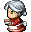

<body style="background-color:snow">


# <span style="color:#3c8d0d;font-weight:bold">WITCHFALL RPG - A STUDENT FINAL PROJECT</span>


 

[](#contributors)

## <span style="color:#3c8d0d">Christmas is Coming!</span> <br>
In North Pole Patrol, Krampus and the dark elves have kidnapped Santa on Christmas Eve!  Can you help Merryweather, one of Santa's elves, save Santa?  This is a Christmas remake of the game Witchfall (Halloween themed) that we did for the final project of our UCLA Web Development Bootcamp.

Based on the Open-Source framework of [React RPG](https://react-rpg.com/) by [Andrew Steinheiser](https://github.com/ASteinheiser/react-rpg.com), North Pole Patrol is a "Work-In-Progress" RPG made with React and Redux.  The game is a turn-based, dungeon crawler that is slowly being changed to a quest system. Currently you can explore 3 maps, battling spiders, frost giants, dark elves and even Krampus, all to rescue Santa and save Christmas!


## [<span style="color:#3c8d0d;text-decoration:underline">Play North Pole Patrol Here!</span>](https://northpolepatrol.herokuapp.com/)   
<br />

## <span style="color:#f21313">Requirements</span>
-  ReactJS  
-  Node & Express  
-  MongoDB  
-  Get & Post Routes  
-  Deployed to Heroku  
-  Two New Libraries / Technologies  <br>
    * Redux, Lodash, Sass & more!
-  User Authentication - Firebase Auth  
-  MVC Folder Structure  
<br>
<br />
## <span style="color:#f21313">How To Play</span> 
<span style="font-size:16px">
<span style="color:#3c8d0d">Merryweather starts off with a elf wand that can blast the ice spiders (and goblins, blobs, wolves) with a wintery blast. The space-bar or enter-key will let you attack the creatures once they are right in front of you.</span><br />

<span style="color:#3c8d0d">Wrapped presents have experience and candy, but more importantly you can get better gear (like a snowball gun!) and edible goodies (candy canes, gingerbread cookies, plum puddings and hot chocolate can all help restore your health!)! Walk onto the present to open it.</span>

<span style="color:#3c8d0d">There are a set number of presents and monsters in the game. You must vanquish ALL the monsters to rescue Santa! You can get to the next map by stepping onto the train engine, and you can go back to the previous map by stepping onto the caboose.
</span>
</span>
<br /> <br />


### <span style="color:#f21313">Opening screens:</span>
 &nbsp; 

### <span style="color:#f21313">Game Controls:</span>
 

### <span style="color:#f21313">Game Play</span> - The messaging is friendly, but also important. It tells you how to get head in the game.
 &nbsp; 
<br />

 &nbsp; 
<br />


## <span style="color:#f21313">How To Play Locally</span> 
Clone and fork the repo to your system.

CD into the main game folder & install all the NPM:
```javascript
npm install
```
Then CD into the client folder and do it again:
```javascript
npm install
```
Then you can run it from the client folder:
```javascript
npm run start
```

<br />

### Read more about React RPG
- [Medium: Making an RPG with React + Redux - written by the maker of the original game code!](https://medium.com/@andrewsteinheiser/making-an-rpg-with-react-redux-dcfffdb06797)

## [<span style="color:#f21313">View Roadmap</span>](docs/roadmap-npp.md) (IN PROGRESS)


## <span style="color:#3c8d0d">Contributors</span>
<!-- ALL-CONTRIBUTORS-LIST:START - Do not remove or modify this section -->
<!-- prettier-ignore -->
<table><tr>
<td align="center"><a href="https://github.com/Lucky-Cat-Gamers"><br /><sub><b>Lucky Cat Gamers</b></sub></a><br /></td>

<td align="center"><a href="https://github.com/GitJoeCode"><br /><sub><b>Joe Shapiro</b></sub></a><br /></td>

<td align="center"><a href="https://github.com/loraxgirl"><br /><sub><b>Krista Clarke</b></sub></a><br /></td>

<td align="center"><a href="https://github.com/duskconductor"><br /><sub><b>Mark Fullton</b></sub></a><br /></td>
</tr></table>

<!-- ALL-CONTRIBUTORS-LIST:END -->


</body>